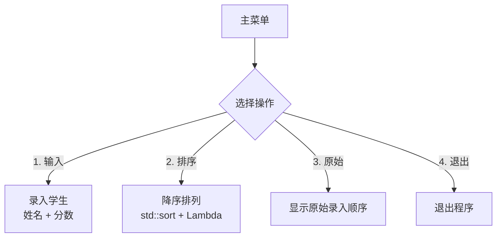
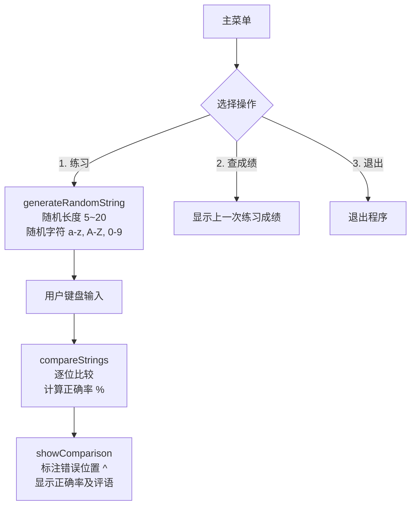
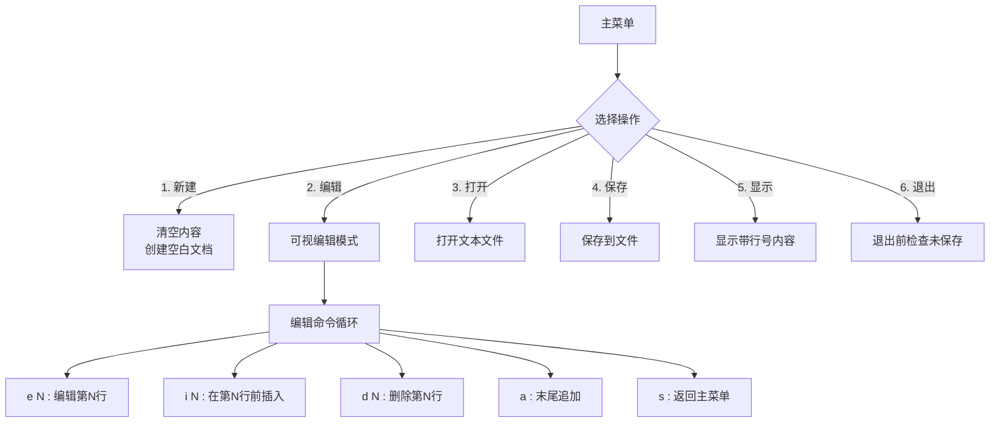
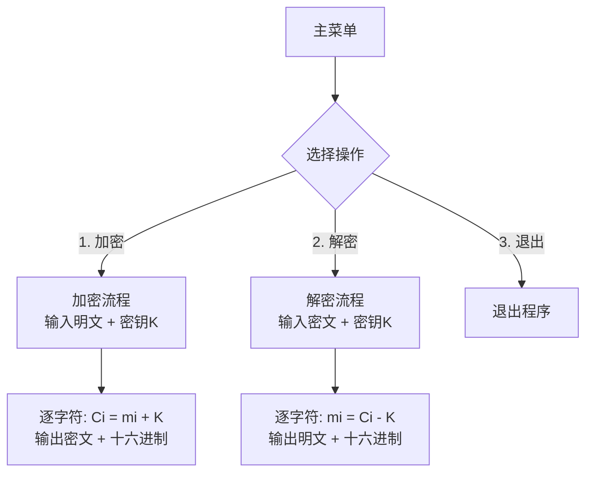
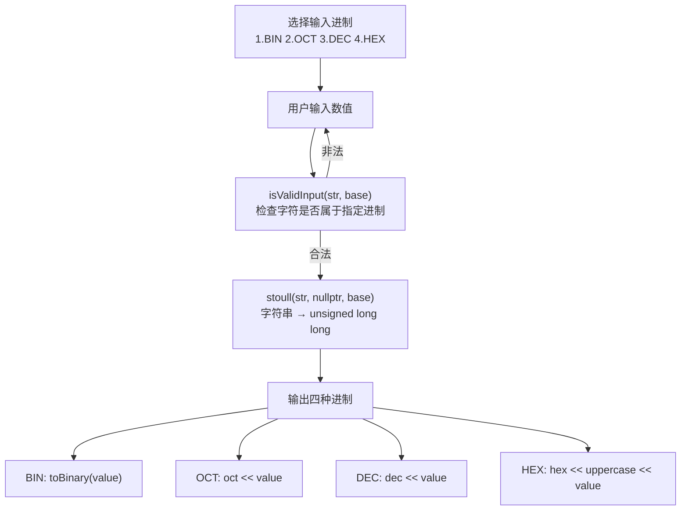
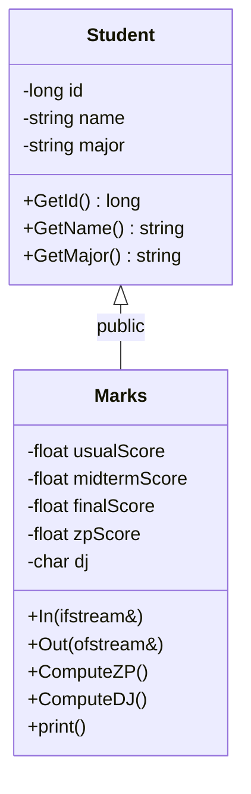
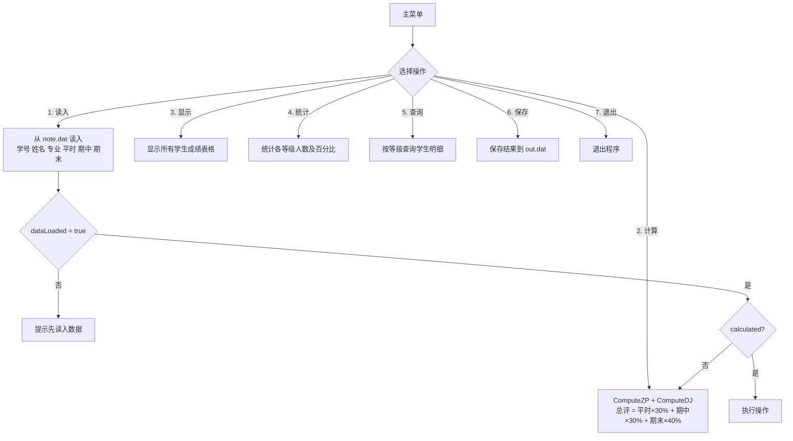
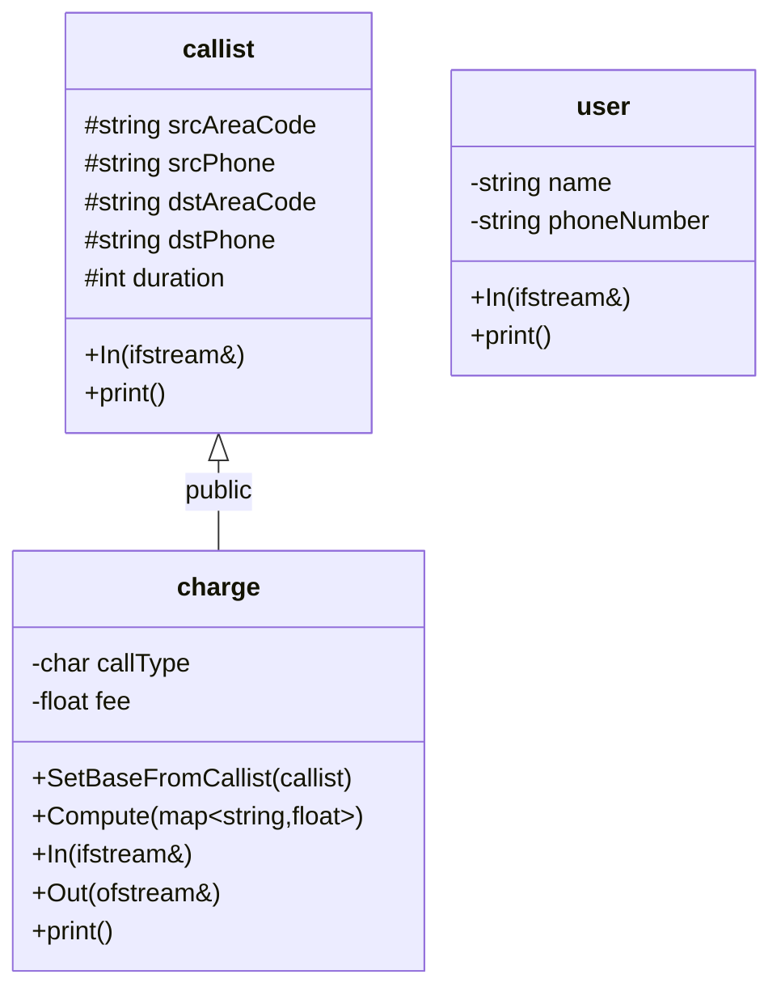
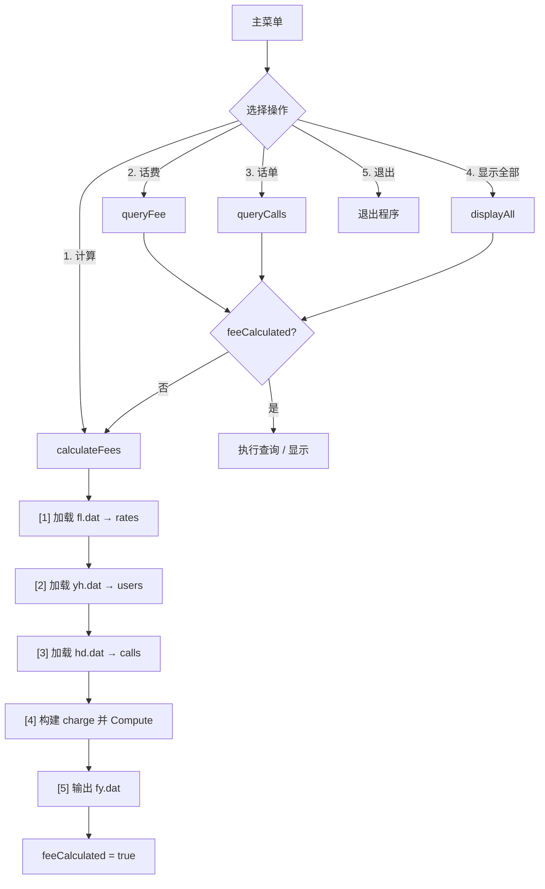

# 软件设计报告

---

## 第一章  软件设计介绍

软件设计是软件开发过程中的核心环节，它将需求分析转化为可实施的软件蓝图。本课程设计涵盖了从基础控制台程序到面向对象GUI应用的多层次实践，旨在通过七个循序渐进的课题，帮助学生掌握C++程序设计的基本方法和软件工程的核心思想。

本次课程设计的七个课题可分为两个层次：

**A系列（基础编程实践）** 包含五个控制台程序：分数统计系统（A1）、打字练习系统（A2）、文本编辑器（A3）、加密解密系统（A4）和进制转换器（A5）。A系列侧重于C++基本语法、标准库使用和控制台交互，适合初学阶段夯实编程基础。

**B系列（面向对象设计）** 包含两个综合项目：学生成绩核算系统（B1）和模拟电信计费系统（B2）。B系列在A系列基础上引入面向对象编程（OOP），要求设计多个类并合理组织.h/.cpp文件，同时提供了控制台版和Qt GUI版两种实现，体现了从控制台到图形界面的技术进阶。

通过本课程设计，学生将掌握C++结构化编程、面向对象设计、文件I/O操作、Qt GUI开发以及VS Code集成开发环境的使用。

---

## 第二章  软件开发平台简介

### 2.1 开发环境

| 组件 | 说明 |
|------|------|
| **操作系统** | Windows 11 |
| **编辑器** | Visual Studio Code |
| **编译器** | Microsoft Visual C++ (MSVC) 14.38.33133 |
| **构建工具** | cl.exe（命令行）、nmake（Qt项目） |
| **Qt版本** | Qt 5.9.6（来自 Anaconda） |
| **调试器** | VS Code C++ 扩展 + MSVC Debugger |

### 2.2 编译配置

MSVC编译器位于 `D:\visual studio\VC\Tools\MSVC\14.38.33130`，通过 `vcvars64.bat` 设置编译环境。所有A系列项目和B系列控制台版使用 `cl.exe` 直接编译，Qt GUI版通过 `qmake` → `nmake` 构建。

编译命令模板（控制台项目）：

```
call "D:\visual studio\VC\Auxiliary\Build\vcvars64.bat" >nul 2>&1
&& cl.exe /utf-8 /EHsc /Zi /std:c++17 /Fe:<输出名>.exe <源文件>.cpp
```

编译选项说明：
- `/utf-8`：支持UTF-8编码的源代码（含中文注释）
- `/EHsc`：启用C++异常处理
- `/Zi`：生成调试信息（PDB文件）
- `/std:c++17`：使用C++17标准

### 2.3 VS Code 任务配置

所有项目均在 `.vscode/tasks.json` 中配置了编译任务（共9个），使用 `Ctrl+Shift+B` 快捷键触发默认构建。任务类型为 `"shell"`，并强制指定 `cmd.exe` 作为shell解释器以确保 `&&` 和 `call` 语法的正确执行。

---

## 第三章  软件设计的内容

### 3.1  分数统计软件（A1）

#### 3.1.1 设计题目及要求

设计一个学生分数统计系统，能够录入多名学生的姓名和成绩，按成绩降序排列显示排名，并支持查看原始录入顺序。

**核心功能**：
1. 输入学生姓名和分数，支持连续录入
2. 按分数降序排列（分数相同时按姓名升序）
3. 显示原始录入顺序
4. 清晰的菜单界面

#### 3.1.2 设计思想及程序流程框图

使用 `vector<Student>` 存储学生信息，`Student` 为结构体包含 `name`（string）和 `score`（double）。排序采用 `std::sort` 配合 Lambda 比较函数实现自定义排序规则。



#### 3.1.3 逻辑功能程序

- **数据结构**：`struct Student { string name; double score; }`
- **核心算法**：`std::sort` + Lambda 表达式 `[](const Student& a, const Student& b) { return a.score > b.score; }`
- **输入校验**：分数输入使用 `cin >> score` 循环验证，确保输入合法数值
- **输出格式**：使用 `setw()` 和 `setprecision()` 格式化表格输出

**核心程序段：**

```cpp
// 学生结构体
struct Student {
    string name;
    double score;
};

// 降序排序（分数相同时按姓名升序）
void sortByScore(vector<Student>& students) {
    sort(students.begin(), students.end(),
        [](const Student& a, const Student& b) {
            if (a.score != b.score) return a.score > b.score; // 分数降序
            return a.name < b.name;       // 分数相同，姓名升序
        });
}

// 主循环 — 菜单驱动
while (true) {
    showMenu();
    cin >> choice;
    switch (choice) {
        case 1: addStudents(students); isSorted = false; break;
        case 2: sortedStudents = students; sortByScore(sortedStudents);
                isSorted = true; displayStudents(sortedStudents, true); break;
        case 3: displayStudents(students, false); break;
        case 4: return 0;
    }
}
```

#### 3.1.4 结果及完善方向

程序实现了基本的学生分数录入、排序和显示功能。**完善方向**：可增加文件持久化（保存/读取学生数据）、多种排序方式（按姓名、按录入顺序）、成绩统计分析（平均分、最高分、最低分）。

---

### 3.2  打字软件（A2）

#### 3.2.1 设计题目及要求

设计一个打字练习系统，随机生成由大小写字母和数字组成的字符串（长度5~20），用户输入相同字符串后，系统逐位比较并显示正确率，标注错误位置。

**核心功能**：
1. 随机生成长度和内容均随机的目标字符串
2. 用户输入后进行逐字符比较
3. 显示正确率百分比和错误位置标注
4. 保存并查看上一次练习成绩

#### 3.2.2 设计思想及程序流程框图

使用 C++ `<random>` 库生成高质量随机字符串。字符池包含26个小写字母、26个大写字母和10个数字共62个字符。使用 `mt19937` 梅森旋转算法作为随机数引擎，结合 `chrono::steady_clock` 和 `random_device` 作为种子源，确保每次运行生成的字符串不同。



#### 3.2.3 逻辑功能程序

- **随机生成**：`uniform_int_distribution<int> lenDist(5, 20)` 控制长度，`uniform_int_distribution<int> charDist(0, 61)` 控制字符
- **比较算法**：遍历目标字符串，逐字符比较，统计正确字符数，正确率 = 正确数 / 总长度 × 100%
- **错误标注**：用 `^` 符号标注每个错误字符的位置，并列出详细信息（应为X, 输入Y）
- **成绩记录**：全局变量 `lastAccuracy` 和 `lastTarget` 保存最近一次练习结果

**核心程序段：**

```cpp
// 字符池：大小写字母 + 数字
const string CHAR_POOL = "abcdefghijklmnopqrstuvwxyz"
                         "ABCDEFGHIJKLMNOPQRSTUVWXYZ"
                         "0123456789";

// 随机生成目标字符串（长度 5~20）
string generateRandomString(int& outLength) {
    static mt19937 rng(chrono::steady_clock::now()
        .time_since_epoch().count() ^ random_device{}());
    uniform_int_distribution<int> lenDist(5, 20);
    uniform_int_distribution<int> charDist(0, (int)CHAR_POOL.size() - 1);
    outLength = lenDist(rng);
    string result;
    for (int i = 0; i < outLength; ++i)
        result += CHAR_POOL[charDist(rng)];
    return result;
}

// 逐位比较，计算正确率
double compareStrings(const string& target, const string& input) {
    int correct = 0;
    for (size_t i = 0; i < target.size(); ++i)
        if (i < input.size() && input[i] == target[i]) correct++;
    return (double)correct / target.size() * 100.0;
}
```

#### 3.2.4 结果及完善方向

程序实现了随机出题、准确率评估和错误反馈。**完善方向**：增加计时功能统计打字速度（WPM）、难度分级（调整字符池和长度范围）、多次练习的统计数据、排行榜功能。

---

### 3.3  文本编辑器（A3）

#### 3.3.1 设计题目及要求

设计一个基于命令行的文本编辑器，支持新建、打开、可视编辑、保存等操作。编辑器以行为单位组织文本，提供行级别的增删改查命令。

**核心功能**：
1. 新建空白文档
2. 可视编辑模式：支持按行号编辑（e）、插入（i）、删除（d）、追加（a）
3. 打开/保存文本文件
4. 显示带行号的文档内容
5. 未保存修改的提示保护

#### 3.3.2 设计思想及程序流程框图

使用 `vector<string>` 按行存储文本内容，`vector` 的下标索引对应行号（0-based → 显示时 +1）。可视编辑模式是一个独立的事件循环，用户输入命令字母+行号参数来控制编辑操作。全局状态包括 `currentFile`（当前文件路径）、`modified`（修改标记）。



#### 3.3.3 逻辑功能程序

- **行存储**：`vector<string> lines` — 每个元素为一行文本
- **编辑命令解析**：读取用户输入行，提取命令字和参数，`stoi()` 转换行号
- **文件I/O**：`ifstream` 按行读取（`getline`），`ofstream` 按行写出
- **未保存保护**：退出前检查 `modified` 标记，提示用户确认
- **输入验证**：行号范围检查，文件存在性检查

**核心程序段：**

```cpp
// 全局状态
vector<string> lines;      // 按行存储文本
string currentFile;        // 当前文件路径
bool modified = false;     // 修改标记

// 可视编辑模式 — 命令循环
void editText() {
    while (true) {
        showEditorView();  // 显示带行号的内容
        string cmd; getline(cin, cmd);
        char op = cmd[0];  // 命令字
        string param = cmd.substr(1);  // 行号参数

        if (op == 's') return;             // 退出编辑
        if (op == 'a') {                   // 末尾追加
            getline(cin, newLine);
            lines.push_back(newLine);
            modified = true;
        }
        int lineNo = stoi(param);
        if (op == 'e') {                   // 编辑第 N 行
            getline(cin, newContent);
            lines[lineNo - 1] = newContent;
            modified = true;
        }
        if (op == 'd') {                   // 删除第 N 行
            lines.erase(lines.begin() + (lineNo - 1));
            modified = true;
        }
        if (op == 'i') {                   // 在第 N 行前插入
            getline(cin, newContent);
            lines.insert(lines.begin() + (lineNo - 1), newContent);
            modified = true;
        }
    }
}

// 打开文件 — 按行读入
void openFile() {
    ifstream inFile(path);
    string line;
    while (getline(inFile, line))
        lines.push_back(line);
    currentFile = path;
    modified = false;
}
```

#### 3.3.4 结果及完善方向

程序实现了一个功能完整的命令行文本编辑器。**完善方向**：增加查找/替换功能、支持Undo/Redo操作栈、使用C++标准文件系统库支持相对路径、增加语法高亮显示。

---

### 3.4  加密软件（A4）

#### 3.4.1 设计题目及要求

设计一个基于简单移位密码的加密/解密系统。加密公式为 `Ci = mi + K`（每个字符的ASCII码值加上密钥K），解密公式为 `mi = Ci - K`。

**核心功能**：
1. 加密明文：输入明文和密钥K，输出密文
2. 解密密文：输入密文和密钥K，输出明文
3. 显示加密/解密计算过程
4. 以十六进制显示结果（便于查看不可打印字符）

#### 3.4.2 设计思想及程序流程框图

采用最简单的移位密码算法。对输入字符串中的每个字符取ASCII码值，加上（加密）或减去（解密）密钥K得到结果字符。算法复杂度为 O(n)，n为字符串长度。



#### 3.4.3 逻辑功能程序

- **加密函数**：`string encrypt(const string& plaintext, int key)` — 遍历每个字符 `c + key` 得到密文
- **解密函数**：`string decrypt(const string& ciphertext, int key)` — 遍历每个字符 `c - key` 得到明文
- **计算过程展示**：输出每个字符的详细计算步骤，包含字符、ASCII值、运算结果
- **十六进制显示**：`showHex()` 使用 `hex << uppercase << setw(2) << setfill('0')` 格式化输出
- **输入验证**：确保明文/密文和密钥均非空

**核心程序段：**

```cpp
// 加密: Ci = mi + K
string encrypt(const string& plaintext, int key) {
    string ciphertext;
    ciphertext.reserve(plaintext.size());
    for (char c : plaintext)
        ciphertext += (char)(c + key);
    return ciphertext;
}

// 解密: mi = Ci - K
string decrypt(const string& ciphertext, int key) {
    string plaintext;
    plaintext.reserve(ciphertext.size());
    for (char c : ciphertext)
        plaintext += (char)(c - key);
    return plaintext;
}

// 计算过程展示（逐字符输出 ASCII 运算）
for (size_t i = 0; i < input.size(); ++i) {
    cout << "  C[" << i << "] = m[" << i << "] + K"
         << " = '" << input[i] << "'(" << (int)(unsigned char)input[i] << ")"
         << " + " << key
         << " = " << (int)(unsigned char)input[i] + key
         << " -> '" << ciphertext[i] << "'\n";
}

// 十六进制显示（便于查看不可打印字符）
void showHex(const string& str, const string& label) {
    cout << label << " (十六进制): ";
    for (unsigned char c : str)
        cout << hex << uppercase << setw(2) << setfill('0') << (int)c << " ";
    cout << dec << "\n";
}
```

#### 3.4.4 结果及完善方向

程序正确实现了移位密码的加密和解密。**完善方向**：支持更复杂的加密算法（Vigenère、AES等）、支持文件加密/解密（而非仅控制台输入）、支持密钥文件、添加Base64编码输出。

---

### 3.5  进制转换器（A5）

#### 3.5.1 设计题目及要求

设计一个进制转换器，支持二进制、八进制、十进制、十六进制之间的相互转换。用户选择输入数据的进制类型，输入数值后自动显示四种进制的转换结果。

**核心功能**：
1. 选择输入进制（BIN/OCT/DEC/HEX）
2. 输入合法性校验（根据进制类型检查字符集）
3. 同时显示四种进制的转换结果
4. 支持大小写十六进制字符（a-f, A-F）

#### 3.5.2 设计思想及程序流程框图

使用C++标准库函数 `stoull()` 将输入字符串按指定进制解析为 `unsigned long long` 整型中间值，再使用 `std::bitset`、`std::oct`、`std::dec`、`std::hex` 流操纵符分别输出四种进制。



#### 3.5.3 逻辑功能程序

- **输入验证**：`isValidInput(str, base)` — 遍历字符串，根据base检查每个字符是否合法（如base=2只允许0/1，base=16允许0-9/A-F）
- **中间转换**：`stoull(input, nullptr, base)` — C++标准库函数，按指定进制解析
- **二进制输出**：`toBinary(n)` — 自行实现（`std::bitset` 不适用于大数），通过不断右移取最低位拼接字符串
- **格式输出**：统一用表格显示四种进制结果

**核心程序段：**

```cpp
// 输入合法性校验
bool isValidInput(const string& str, int base) {
    for (char c : str) {
        bool valid = false;
        switch (base) {
            case 2:  valid = (c == '0' || c == '1'); break;
            case 8:  valid = (c >= '0' && c <= '7'); break;
            case 10: valid = (c >= '0' && c <= '9'); break;
            case 16: valid = isxdigit(c); break;
        }
        if (!valid) return false;
    }
    return true;
}

// 中间转换：字符串 → unsigned long long
unsigned long long value = stoull(input, nullptr, base);

// 自定义二进制转换（支持大数）
string toBinary(unsigned long long n) {
    if (n == 0) return "0";
    string result;
    while (n > 0) {
        result = (char)('0' + (n & 1)) + result;
        n >>= 1;
    }
    return result;
}

// 输出四种进制
void showConversion(unsigned long long value, const string& input, int srcBase) {
    cout << "二进制   (BIN): " << toBinary(value) << "\n";
    cout << "八进制   (OCT): " << oct << value << "\n";
    cout << "十进制   (DEC): " << dec << value << "\n";
    cout << "十六进制 (HEX): " << uppercase << hex << value << "\n";
}
```

#### 3.5.4 结果及完善方向

程序实现了四种进制的互转和严格的输入验证。**完善方向**：支持小数部分的进制转换、支持负数（补码表示）、添加自定义进制（如36进制）、支持批量转换。

---

### 3.6  学生成绩核算系统的设计与实现（B1）

#### 3.6.1 设计题目及要求

设计一个学生成绩核算系统，从文件读入学生成绩数据，计算总评成绩（综合平时、期中、期末），评定等级（A-E），提供统计分析和等级查询功能。

**核心功能**：
1. 从 `note.dat` 文件读入学生成绩（学号、姓名、专业、平时、期中、期末）
2. 计算总评成绩：平时×30% + 期中×30% + 期末×40%
3. 评定等级：A(90-100)、B(80-89)、C(70-79)、D(60-69)、E(0-59)
4. 显示所有学生成绩表格
5. 统计各等级人数及百分比
6. 按等级查询学生明细
7. 保存结果到 `out.dat`
8. 提供 Qt GUI 版本

#### 3.6.2 设计思想及程序流程框图

采用面向对象设计，设计两个类：`Student`（基类，存储学号/姓名/专业）和 `Marks`（派生类，增加成绩字段和计算功能）。类的职责分离清晰：`Student` 负责基本信息，`Marks` 负责成绩相关的计算和显示。

**类继承关系**：



**程序主流程**：



#### 3.6.3 逻辑功能程序

- **Student 类** (`student.h/cpp`)：封装学号（long）、姓名（string）、专业（string），提供 getter/setter
- **Marks 类** (`marks.h/cpp`)：继承 Student，增加平时/期中/期末/总评成绩（float）和等级（char）
  - `ComputeZP()`：`zpScore = usual×0.30 + midterm×0.30 + final×0.40`
  - `ComputeDJ()`：根据 zpScore 范围映射到 A-E 等级
  - `In(ifstream&)` / `Out(ofstream&)`：文件读写
  - `print()`：屏幕格式化输出
- **全局状态**：`dataLoaded` 和 `calculated` 标志位控制操作流程，未读入数据时拒绝计算/显示，未计算时自动触发计算
- **等级统计**：遍历所有学生，switch-case 累计各等级人数，计算百分比
- **等级查询**：用户输入等级字母，遍历过滤并显示匹配学生

**Qt GUI 版**：(`mainwindow.cpp/h`, `qt_main.cpp`) 提供图形界面，包含表格显示、按钮触发、输入对话框等功能。

**核心程序段：**

```cpp
// ═══════════════ Student 基类 ═══════════════
class Student {
private:
    long id;
    std::string name;
    std::string major;
public:
    long GetId() const;
    std::string GetName() const;
    std::string GetMajor() const;
};

// ═══════════════ Marks 派生类 ═══════════════
class Marks : public Student {
    static constexpr float USUAL_PCT   = 0.30f;
    static constexpr float MIDTERM_PCT = 0.30f;
    static constexpr float FINAL_PCT   = 0.40f;
private:
    float usualScore, midtermScore, finalScore;
    float zpScore;    // 总评成绩
    char  dj;         // 等级 A-E
public:
    void In(std::ifstream& in);    // 从文件读入
    void Out(std::ofstream& out);  // 写出到文件
    void ComputeZP();              // 计算总评
    void ComputeDJ();              // 评定等级
};

// 总评成绩 = 平时×30% + 期中×30% + 期末×40%
void Marks::ComputeZP() {
    zpScore = usualScore * USUAL_PCT
            + midtermScore * MIDTERM_PCT
            + finalScore * FINAL_PCT;
}

// 等级评定
void Marks::ComputeDJ() {
    if (zpScore >= 90)      dj = 'A';
    else if (zpScore >= 80) dj = 'B';
    else if (zpScore >= 70) dj = 'C';
    else if (zpScore >= 60) dj = 'D';
    else                    dj = 'E';
}

// 等级统计
int countA = 0, countB = 0, countC = 0, countD = 0, countE = 0;
for (const auto& s : students) {
    switch (s.GetDJ()) {
        case 'A': countA++; break; case 'B': countB++; break;
        case 'C': countC++; break; case 'D': countD++; break;
        case 'E': countE++; break;
    }
}
```

#### 3.6.4 结果及完善方向

程序实现了完整的成绩核算流程和良好的面向对象设计。类层次结构清晰，职责分离合理，控制台版和Qt GUI版均功能完整。**完善方向**：增加数据修改功能（可视编辑成绩）、支持Excel/CSV导入导出、图表展示成绩分布、多班级管理。

---

### 3.7  模拟电信计费系统的设计与实现（B2）

#### 3.7.1 设计题目及要求

设计一个模拟电信计费系统，从源数据文件读入通话记录，根据费率表计算通话费用，支持话费和话单查询。

**核心功能**：
1. 计算通话费用：加载话单（`hd.dat`）、费率（`fl.dat`）、用户（`yh.dat`），计算费用并生成 `fy.dat`
2. 话费查询：按电话号码查询，汇总本地话费和长途话费
3. 话单查询：按电话号码查询原始通话记录
4. 显示全部话单
5. 查询前自动计算费用（全局变量方案）
6. 提供 Qt GUI 版本

**计费规则**：
- 时长取整：`minutes = (seconds + 59) / 60`
- 本地通话（区号相同）：≤3分钟0.50元，超出部分每3分钟加0.20元
- 长途通话（区号不同）：`费率 × 分钟数`

#### 3.7.2 设计思想及程序流程框图

采用面向对象设计，设计三个类：`callist`（话单基类）、`charge`（费用派生类）、`user`（用户类）。`charge` 继承自 `callist`，在基类通话记录的基础上增加费用计算功能。

**类继承关系**：



**程序主流程**：



#### 3.7.3 逻辑功能程序

- **callist 类** (`callist.h/cpp`)：话单基类，存储通话四要素（主被叫区号和号码）+ 通话时长，支持从 `hd.dat` 读入和屏幕显示
- **charge 类** (`charge.h/cpp`)：继承 callist，增加通话类型判断和费用计算
  - `SetBaseFromCallist()`：从 callist 对象复制基类数据
  - `Compute(rates)`：比较主被叫区号判断本地/长途 → 按规则计算费用
  - 常量为 `LOCAL_BASE=0.50f, LOCAL_INCR=0.20f, LOCAL_BASE_MIN=3, LOCAL_STEP_MIN=3`
  - `In/Out(fstream)`：费用文件的读写操作
- **user 类** (`user.h/cpp`)：独立类，存储用户姓名和电话号码，支持从 `yh.dat` 读入
- **全局状态**：`feeCalculated` 标志位，查询函数检测到此标志为 false 时自动触发 `calculateFees()`
- **话费查询算法**：遍历 charges，按主叫号码匹配，累计本地话费和长途话费
- **话单查询算法**：遍历 calls，按主叫号码匹配，显示匹配的原始通话记录

**Qt GUI 版**：(`mainwindow.cpp/h`, `qt_main.cpp`) 提供图形界面，包含数据导入按钮、话费/话单查询输入框、结果表格显示、统计摘要面板。使用 `QSplitter` 实现左右分栏布局，查询操作自动检测 `m_calculated` 标志并触发 `onCalculate()`。

**核心程序段：**

```cpp
// ═══════════════ callist 话单基类 ═══════════════
class callist {
protected:
    std::string srcAreaCode, srcPhone;   // 主叫
    std::string dstAreaCode, dstPhone;   // 被叫
    int duration;                        // 通话时长(秒)
public:
    void In(std::ifstream& in);          // 从 hd.dat 读入
    void print() const;                  // 屏幕显示
};

// ═══════════════ charge 费用派生类 ═══════════════
class charge : public callist {
    static constexpr float LOCAL_BASE     = 0.50f;
    static constexpr float LOCAL_INCR     = 0.20f;
    static constexpr int   LOCAL_BASE_MIN = 3;
    static constexpr int   LOCAL_STEP_MIN = 3;
private:
    char  callType;   // '0'=本地, '1'=长途
    float fee;
public:
    void SetBaseFromCallist(const callist& c);
    void Compute(const std::map<std::string, float>& rates);
};

// 费用计算核心算法
void charge::Compute(const map<string, float>& rates) {
    int minutes = (duration + 59) / 60;               // 秒→分钟（向上取整）
    if (srcAreaCode == dstAreaCode) {                  // 本地通话
        callType = '0';
        if (minutes <= LOCAL_BASE_MIN)
            fee = LOCAL_BASE;                          // ≤3分钟: 0.50
        else
            fee = LOCAL_BASE + ceil((minutes - LOCAL_BASE_MIN)
                      / (float)LOCAL_STEP_MIN) * LOCAL_INCR;
    } else {                                           // 长途通话
        callType = '1';
        float rate = rates.at(dstAreaCode);            // 查费率表
        fee = rate * minutes;                          // 费率 × 分钟数
    }
}

// 话费查询 — 按号码汇总本地/长途费用
void queryFee() {
    if (!feeCalculated) { calculateFees(); }           // 自动触发
    string phone; cin >> phone;
    float localFee = 0.0f, longFee = 0.0f;
    for (const auto& chg : charges) {
        if (chg.GetSrcPhone() == phone) {
            if (chg.GetCallType() == '0')
                localFee += chg.GetFee();
            else
                longFee += chg.GetFee();
        }
    }
    cout << "本地话费: " << localFee << "  长途话费: " << longFee
         << "  总计: " << (localFee + longFee) << "\n";
}
```

#### 3.7.4 结果及完善方向

程序实现了完整的电信计费模拟系统，三个类的设计合理，继承关系清晰体现了"话单→费用"的语义。控制台版和Qt GUI版均功能完整，查询前自动计算费用提供了良好的用户体验。**完善方向**：增加按时间段查询（按日期范围筛选）、支持多种费率套餐、增加国际长途费率、数据库存储替代文件存储、生成账单报表。

---

## 第四章  心得体会

通过本次软件设计课程七个课题的实践，我在以下方面获得了显著的提升：

**编程基础方面**：A系列的五个控制台程序让我系统复习了C++的核心语法——包括STL容器（`vector`、`map`、`string`）、标准算法（`std::sort`）、流I/O操作、随机数生成、异常处理等。这些基础练习为后续的复杂项目打下了坚实根基。

**面向对象设计方面**：B系列的两个项目让我深刻理解了OOP的核心概念。在B1中，`Student` → `Marks` 的继承关系体现了"is-a"语义，派生类在基类基础上扩展了成绩计算能力。在B2中，`callist` → `charge` 的继承关系将原始通话数据和费用计算有机结合起来。独立类`user`的设计则体现了"单一职责原则"。将类的声明和实现分离为 `.h` 和 `.cpp` 文件，也让我养成了良好的工程习惯。

**Qt GUI开发方面**：B1和B2的Qt版本让我体验了从控制台到图形界面的跨越。学习了`QWidget`、`QTableWidget`、`QSplitter`、信号槽机制等Qt核心概念，理解了MVC模式在实际项目中的应用。

**开发工具链方面**：掌握了MSVC命令行编译、qmake/nmake构建流程、VS Code的tasks.json和launch.json配置。解决了PowerShell与cmd语法不兼容、字符编码等实际问题，积累了宝贵的工具链经验。

**工程规范方面**：学会了使用 `.gitignore` 管理编译产物、使用Git进行版本控制、编写Markdown文档。这些工程实践对于团队协作和项目维护至关重要。

总体而言，本课程设计达到了理论与实践相结合的目标，使我具备了使用C++独立开发中小规模软件系统的能力。

---

> **开发环境**：Windows 11 + VS Code + MSVC 14.38 + Qt 5.9.6  
> **项目地址**：`e:\PracticeWeek`  
> **完成日期**：2026年6月
